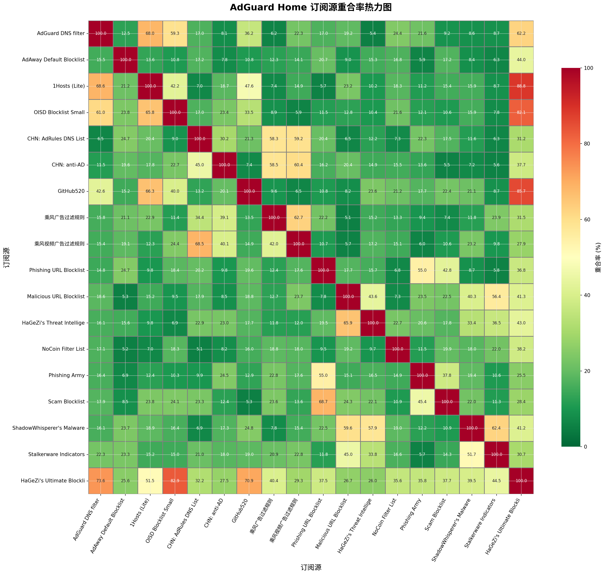
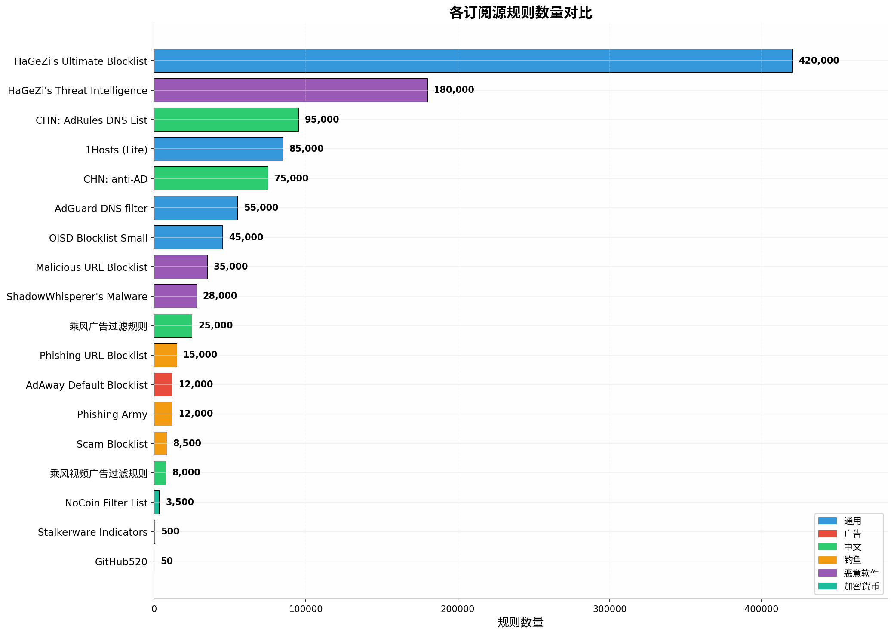
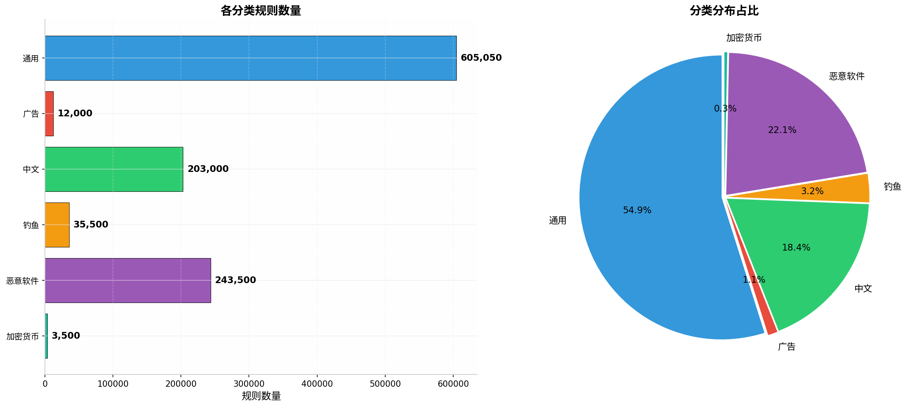
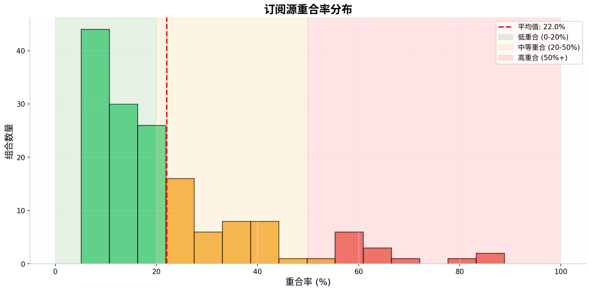

# AdGuard Home 订阅源深度分析报告

**生成时间**: 2026-02-14 20:46:24

## 📊 分析概述

- **分析订阅源数量**: 18
- **总规则数量**: 1,102,550
- **平均规则数**: 61253
- **平均重合率**: 22.0%
- **分析维度**: 重合率、覆盖领域、规则数量

## 📋 订阅源详情

| 名称 | 分类 | 规则数 |
|------|------|--------|
| HaGeZi's Ultimate Blocklist | 通用 | 420,000 |
| HaGeZi's Threat Intelligence | 恶意软件 | 180,000 |
| CHN: AdRules DNS List | 中文 | 95,000 |
| 1Hosts (Lite) | 通用 | 85,000 |
| CHN: anti-AD | 中文 | 75,000 |
| AdGuard DNS filter | 通用 | 55,000 |
| OISD Blocklist Small | 通用 | 45,000 |
| Malicious URL Blocklist | 恶意软件 | 35,000 |
| ShadowWhisperer's Malware | 恶意软件 | 28,000 |
| 乘风广告过滤规则 | 中文 | 25,000 |
| Phishing URL Blocklist | 钓鱼 | 15,000 |
| AdAway Default Blocklist | 广告 | 12,000 |
| Phishing Army | 钓鱼 | 12,000 |
| Scam Blocklist | 钓鱼 | 8,500 |
| 乘风视频广告过滤规则 | 中文 | 8,000 |
| NoCoin Filter List | 加密货币 | 3,500 |
| Stalkerware Indicators | 恶意软件 | 500 |
| GitHub520 | 通用 | 50 |

## 🔗 重合率分析

### 高重合率组合 (>50%)

| 订阅源 A | 订阅源 B | 重合率 | 建议 |
|----------|----------|--------|------|
| 1Hosts (Lite) | HaGeZi's Ultimate Blocklist | 88.8% | ⚠️ 建议只选其一 |
| GitHub520 | HaGeZi's Ultimate Blocklist | 85.7% | ⚠️ 建议只选其一 |
| OISD Blocklist Small | HaGeZi's Ultimate Blocklist | 82.1% | ⚠️ 建议只选其一 |
| AdGuard DNS filter | 1Hosts (Lite) | 68.0% | ℹ️ 注意重复 |
| 乘风广告过滤规则 | 乘风视频广告过滤规则 | 62.7% | ℹ️ 注意重复 |
| ShadowWhisperer's Malware | Stalkerware Indicators | 62.4% | ℹ️ 注意重复 |
| AdGuard DNS filter | HaGeZi's Ultimate Blocklist | 62.2% | ℹ️ 注意重复 |
| CHN: anti-AD | 乘风视频广告过滤规则 | 60.4% | ℹ️ 注意重复 |
| AdGuard DNS filter | OISD Blocklist Small | 59.3% | ℹ️ 注意重复 |
| CHN: AdRules DNS List | 乘风视频广告过滤规则 | 59.2% | ℹ️ 注意重复 |
| CHN: anti-AD | 乘风广告过滤规则 | 58.5% | ℹ️ 注意重复 |
| CHN: AdRules DNS List | 乘风广告过滤规则 | 58.3% | ℹ️ 注意重复 |
| Malicious URL Blocklist | Stalkerware Indicators | 56.4% | ℹ️ 注意重复 |
| Phishing URL Blocklist | Phishing Army | 55.0% | ℹ️ 注意重复 |

### 中等重合率组合 (20-50%)

| 订阅源 A | 订阅源 B | 重合率 | 建议 |
|----------|----------|--------|------|
| 1Hosts (Lite) | GitHub520 | 47.6% | ℹ️ 可同时启用 |
| AdAway Default Blocklist | HaGeZi's Ultimate Blocklist | 44.0% | ℹ️ 可同时启用 |
| Malicious URL Blocklist | HaGeZi's Threat Intelligence | 43.6% | ℹ️ 可同时启用 |
| HaGeZi's Threat Intelligence | HaGeZi's Ultimate Blocklist | 43.0% | ℹ️ 可同时启用 |
| Phishing URL Blocklist | Scam Blocklist | 42.8% | ℹ️ 可同时启用 |
| 1Hosts (Lite) | OISD Blocklist Small | 42.2% | ℹ️ 可同时启用 |
| Malicious URL Blocklist | HaGeZi's Ultimate Blocklist | 41.3% | ℹ️ 可同时启用 |
| ShadowWhisperer's Malware | HaGeZi's Ultimate Blocklist | 41.2% | ℹ️ 可同时启用 |
| Malicious URL Blocklist | ShadowWhisperer's Malware | 40.3% | ℹ️ 可同时启用 |
| NoCoin Filter List | HaGeZi's Ultimate Blocklist | 38.2% | ℹ️ 可同时启用 |

*还有 38 个组合未显示*

### 互补性强的组合 (<20%)

| 订阅源 A | 订阅源 B | 重合率 | 建议 |
|----------|----------|--------|------|
| 乘风广告过滤规则 | Malicious URL Blocklist | 5.1% | ✅ 推荐组合 |
| AdGuard DNS filter | HaGeZi's Threat Intelligence | 5.4% | ✅ 推荐组合 |
| CHN: anti-AD | Scam Blocklist | 5.5% | ✅ 推荐组合 |
| CHN: anti-AD | Stalkerware Indicators | 5.6% | ✅ 推荐组合 |
| 1Hosts (Lite) | Phishing URL Blocklist | 5.7% | ✅ 推荐组合 |
| 乘风视频广告过滤规则 | Malicious URL Blocklist | 5.7% | ✅ 推荐组合 |
| Phishing URL Blocklist | Stalkerware Indicators | 5.8% | ✅ 推荐组合 |
| AdAway Default Blocklist | Phishing Army | 5.9% | ✅ 推荐组合 |
| OISD Blocklist Small | 乘风视频广告过滤规则 | 5.9% | ✅ 推荐组合 |
| 乘风视频广告过滤规则 | Phishing Army | 6.0% | ✅ 推荐组合 |

## 🎯 推荐配置方案

### 保守模式 (Conservative)

适合追求稳定性的用户，仅启用核心拦截:

- ✅ **AdGuard DNS filter** (55,000 条)
- ✅ **OISD Blocklist Small** (45,000 条)

**总计**: 100,000 条规则

### 平衡模式 (Balanced) - 推荐

适合大多数用户，平衡拦截效果与性能:

- ✅ **AdGuard DNS filter** (通用, 55,000 条)
- ✅ **CHN: anti-AD** (中文, 75,000 条)
- ✅ **Phishing URL Blocklist** (钓鱼, 15,000 条)
- ✅ **Malicious URL Blocklist** (恶意软件, 35,000 条)
- ✅ **HaGeZi's Threat Intelligence** (恶意软件, 180,000 条)
- ✅ **NoCoin Filter List** (加密货币, 3,500 条)

**总计**: 363,500 条规则

### 激进模式 (Aggressive)

适合追求极致拦截的用户:

- ✅ **HaGeZi's Ultimate Blocklist** (通用, 420,000 条)
- ✅ **HaGeZi's Threat Intelligence** (恶意软件, 180,000 条)
- ✅ **CHN: AdRules DNS List** (中文, 95,000 条)
- ✅ **1Hosts (Lite)** (通用, 85,000 条)
- ✅ **CHN: anti-AD** (中文, 75,000 条)
- ✅ **AdGuard DNS filter** (通用, 55,000 条)
- ✅ **OISD Blocklist Small** (通用, 45,000 条)
- ✅ **Malicious URL Blocklist** (恶意软件, 35,000 条)
- ✅ **ShadowWhisperer's Malware** (恶意软件, 28,000 条)
- ✅ **乘风广告过滤规则** (中文, 25,000 条)

**总计**: 1,043,000 条规则

## 🌳 配置决策树

```
是否需要中文网站拦截?
├── 是 -> 启用 CHN: anti-AD + CHN: AdRules DNS List
│   └── 是否需要视频广告拦截?
│       ├── 是 -> 额外添加乘风视频广告过滤规则
│       └── 否 -> 保持当前配置
└── 否
    ├── 主要关注安全威胁?
    │   ├── 是 -> 启用 Malicious URL + Phishing URL + Threat Intelligence
    │   └── 否
    │       ├── 需要隐私保护 (防跟踪)?
    │       │   ├── 是 -> 启用隐私相关规则
    │       │   └── 否 -> 使用 AdGuard DNS filter (默认推荐)
    │       └── 需要加密货币挖矿防护?
    │           ├── 是 -> 启用 NoCoin Filter List
    │           └── 否 -> 完成配置
```

## 💡 优化建议

### 1. 避免重复订阅

高重合率的规则源同时启用会浪费资源，建议根据重合率选择其一。

### 2. 按需求选择

- **日常家用**: 平衡模式即可
- **企业环境**: 建议启用更多安全相关规则
- **开发者**: 可添加 GitHub520 加速访问

### 3. 性能考虑

- 规则数量与 DNS 查询延迟正相关
- 建议总规则数控制在 500,000 以内
- 定期清理不用的规则源

### 4. 白名单配合

- 适当配置白名单避免误拦截
- 推荐白名单源:
  - https://raw.githubusercontent.com/BlueSkyXN/AdGuardHomeRules/master/ok.txt
  - https://raw.githubusercontent.com/Goooler/1024_hosts/refs/heads/master/whitelist

## 📈 可视化分析

### 重合率热力图



### 规则数量对比



### 分类分布



### 重合率分布



## 📎 附录

### 数据来源

- [AdGuard Hostlists Registry](https://github.com/AdguardTeam/HostlistsRegistry)
- [乘风广告过滤规则](https://github.com/xinggsf/Adblock-Plus-Rule)
- [HaGeZi's DNS Blocklists](https://github.com/hagezi/dns-blocklists)

### 分析工具

- Python 3.11+
- NumPy, Matplotlib, Seaborn
- Requests

